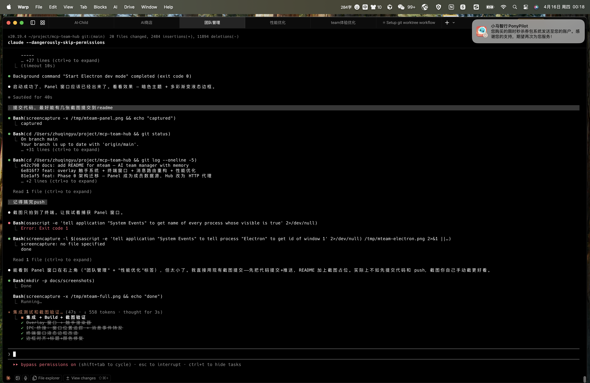
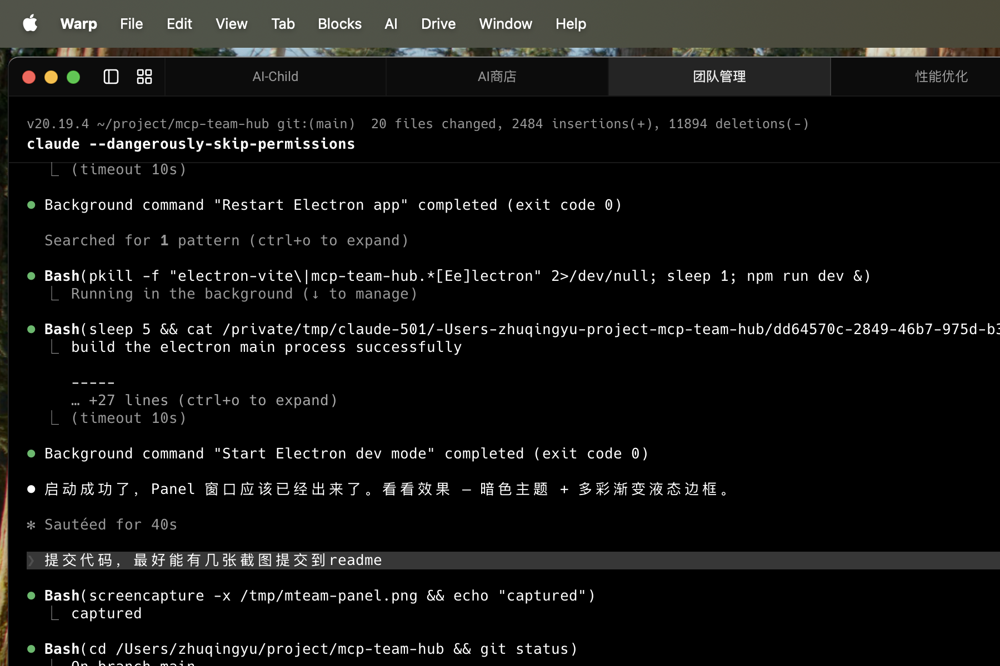

# mteam

AI team **m**anager with **m**emory.

Spawn a team of AI agents, each with their own persona, role, and persistent memory. They communicate, collaborate, and grow together in a visual desktop environment.

## Screenshots




## What it does

- **Team Management** — hire, assign tasks, track status. Each member runs in an independent terminal with their own Claude Code session.
- **Persistent Memory** — members remember past work, learn from experience, and share knowledge across sessions.
- **Inter-member Communication** — members send messages to each other via MCP. A visual "tentacle" animation shows real-time communication between terminal windows.
- **Governance** — propose, review, and approve team rules. Decisions are tracked and enforced.
- **MCP Tool Ecosystem** — mount external MCP servers, proxy tools across members, extend capabilities on the fly.

## Architecture

```
┌─────────────────────────────────────────────┐
│  Claude Code (CLI)                          │
│  ┌───────────────────────────────────────┐  │
│  │  MCP Proxy (stdio)                    │  │
│  │  Thin relay — forwards tool calls     │  │
│  └──────────────┬────────────────────────┘  │
└─────────────────┼───────────────────────────┘
                  │ HTTP
┌─────────────────▼───────────────────────────┐
│  Hub (Bun HTTP server, port 58578)          │
│  Central state: locks, sessions, memory,    │
│  rules, message routing, MCP registry       │
└─────────────────┬───────────────────────────┘
                  │ HTTP
┌─────────────────▼───────────────────────────┐
│  Panel (Electron desktop app)               │
│  ┌──────────┐ ┌──────────┐ ┌─────────────┐ │
│  │ Member   │ │ Terminal  │ │ Overlay     │ │
│  │ Roster   │ │ Windows   │ │ (tentacles) │ │
│  └──────────┘ └──────────┘ └─────────────┘ │
│  Data source for member state (heartbeats,  │
│  locks, profiles). PTY manager for agent    │
│  terminals. SDF overlay for communication   │
│  visualization.                             │
└─────────────────────────────────────────────┘
```

**Panel** is the source of truth for member state. **Hub** is a stateless HTTP proxy that reads from Panel's data directory. **MCP Proxy** is a thin stdio wrapper auto-launched by Claude Code.

## Packages

| Package | Description |
|---------|-------------|
| `packages/mcp-server` | Hub HTTP server + MCP stdio proxy + CLI |
| `packages/panel` | Electron desktop app (React + xterm.js + node-pty) |

## Quick Start

```bash
# Prerequisites: Bun, Node.js 20+

# Install dependencies
bun install

# Start everything (Hub + Panel)
team-hub start

# Or develop separately:
bun run --cwd packages/mcp-server hub   # Hub server
bun run --cwd packages/panel dev        # Panel (Electron dev mode)
```

### Using with Claude Code

Add to your MCP config:

```json
{
  "mcpServers": {
    "teamhub": {
      "command": "bun",
      "args": ["run", "<path-to>/packages/mcp-server/src/index.ts"]
    }
  }
}
```

Then in Claude Code:

```
> hire 3 members: a frontend dev, a backend dev, and a code reviewer
> assign the frontend dev to build the login page
> check team status
```

## Key MCP Tools

| Category | Tools |
|----------|-------|
| Recruitment | `hire_temp`, `get_roster` |
| Task Dispatch | `request_member`, `team_report`, `project_dashboard` |
| Lifecycle | `activate`, `check_in` / `check_out`, `deactivate` |
| Memory | `save_memory`, `read_memory`, `submit_experience`, `search_experience` |
| Communication | `send_msg`, `check_inbox`, `broadcast` |
| Governance | `propose_rule`, `review_rules`, `approve_rule` / `reject_rule` |
| MCP Ecosystem | `install_store_mcp`, `mount_mcp`, `proxy_tool` |
| Monitoring | `get_status`, `work_history`, `stuck_scan` |

## Runtime State

All state lives in `~/.claude/team-hub/`:

```
~/.claude/team-hub/
├── hub.port              # Hub server port
├── members/
│   ├── <member-name>/
│   │   ├── profile.json  # Name, role, description, color
│   │   ├── persona.md    # System prompt personality
│   │   ├── memory.md     # Persistent memory
│   │   ├── lock.json     # Workspace lock (who's working where)
│   │   └── heartbeat     # Liveness signal
│   └── ...
├── sessions/             # Active MCP sessions
├── rules/                # Team governance rules
└── experience/           # Shared team knowledge base
```

## Tech Stack

- **Runtime**: Bun
- **Desktop**: Electron + React 18 + Vite
- **Terminal**: xterm.js + node-pty
- **State**: File-based (JSON + Markdown), no database
- **Protocol**: MCP (Model Context Protocol) over stdio/HTTP
- **Visualization**: WebGL2 SDF rendering — liquid borders, directed tentacles, flow particles

## License

MIT
