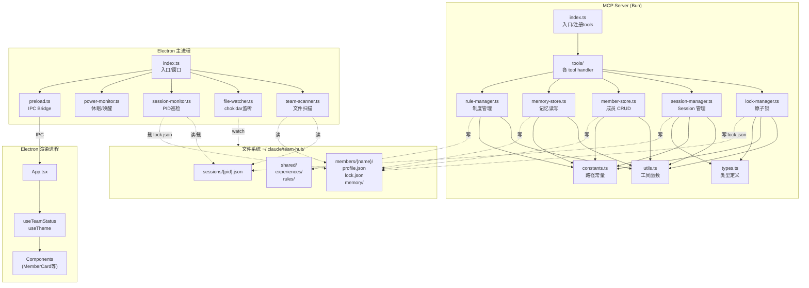

# MCP Team Hub — 技术设计文档

> 版本：v0.1 | 日期：2026-04-13 | 作者：架构-阿构

---

## 一、模块划分与职责

### 1.1 MCP Server（`packages/mcp-server/src/`）

| 文件 | 职责 | 复杂度 |
|------|------|--------|
| `index.ts` | MCP server 入口，注册所有 tools，stdio transport 初始化 | 低 |
| `constants.ts` | 路径常量（TEAM_HUB_DIR, SESSIONS_DIR, MEMBERS_DIR, SHARED_DIR）、超时值 | 低 |
| `types.ts` | 所有类型定义（SessionFile, LockFile, ProfileFile, MemberRecord, RuleRecord…） | 低 |
| `utils.ts` | safeReadJson、isPidAlive、getPidLstart、atomicWriteJson、safeRmSync | 中 |
| `lock-manager.ts` | 原子锁操作：nonce 生成、link 创建抢锁、rename 接管、CAS 删除；防多方同时持锁 | 高 |
| `session-manager.ts` | Session 注册（写 sessions/{pid}.json）、stdin 检测失活清理、面板启动 spawn、启动时全扫孤儿清理 | 高 |
| `member-store.ts` | 成员 CRUD：profile 读写、正式/临时类型、工作目录列表管理 | 中 |
| `memory-store.ts` | 记忆读写：个人通用/项目维度、共享经验目录、模糊搜索、去重 | 中 |
| `rule-manager.ts` | 共享制度：提议/审核/批准/驳回状态机、内容查重 | 中 |
| `tools/` | 每个 MCP tool 的 handler（按功能分文件，调用上述 store/manager） | 中 |

#### tools/ 目录建议拆分

```
tools/
  session-tools.ts    — register_session / unregister_session
  member-tools.ts     — create_member / update_member / list_members / delete_member
  lock-tools.ts       — acquire_lock / release_lock / steal_lock
  memory-tools.ts     — write_memory / read_memory / search_memory
  rule-tools.ts       — propose_rule / review_rule / list_rules
  panel-tools.ts      — launch_panel
```

### 1.2 Electron 面板（`packages/panel/src/`）

#### 主进程（`src/main/`）

**当前状态**：`index.ts` 已实现，包含 scanTeamStatus、inspectSessions、chokidar 监听、5s 轮询、powerMonitor、auto-quit、IPC 注册。

建议拆分为：

| 文件 | 职责 | 当前状态 |
|------|------|---------|
| `index.ts` | 入口：窗口创建、app 生命周期、单例锁 | 已实现（含其他逻辑，需拆分） |
| `file-watcher.ts` | chokidar 启停、onChange 回调通知 | 待拆分自 index.ts |
| `session-monitor.ts` | inspectSessions（PID 巡检 + 孤儿锁清理）、5s poll | 待拆分自 index.ts |
| `power-monitor.ts` | suspend/resume 事件处理，恢复延迟重启逻辑 | 待拆分自 index.ts |
| `team-scanner.ts` | scanTeamStatus：读 sessions/、读 members/、组装 TeamStatus | 待拆分自 index.ts |
| `preload.ts` | contextBridge IPC 暴露（已实现） | 已实现 |

> 注意：当前 `index.ts` 是一个 ~400 行的大文件，已具备完整功能但未拆分。开发时可以选择直接在其上迭代，也可以按上述边界拆分后再扩展。

#### 渲染进程（`src/renderer/`）

| 文件 | 职责 | 复杂度 |
|------|------|--------|
| `App.tsx` | 根组件，订阅 IPC status-update | 低 |
| `components/StatusPanel.tsx` | 顶部状态栏（健康/异常指示） | 低 |
| `components/MemberCard.tsx` | 单个成员卡片（名字/角色/忙碌状态/项目/任务） | 低 |
| `components/ProjectGroup.tsx` | 按项目分组展示成员 | 低 |
| `components/Footer.tsx` | 底部（session 数量、最后扫描时间） | 低 |
| `hooks/useTeamStatus.ts` | 初始化 + 订阅 status-update，管理本地 state | 低 |
| `hooks/useTheme.ts` | 初始化 + 订阅 theme-change | 低 |
| `types.ts` | 渲染进程类型（可复用 main/index.ts 中的 export） | 低 |

---

## 二、模块间依赖关系图



**独立模块**（无强依赖，可并行开发）：
- `types.ts` / `constants.ts` — 纯声明，无依赖
- `memory-store.ts` — 只依赖 utils/constants/types，与 lock/session 无耦合
- `rule-manager.ts` — 同上
- Electron 渲染进程全部 — 只依赖 IPC 契约，与 MCP Server 无代码耦合

**强依赖链**（必须按序）：
```
constants.ts + types.ts → utils.ts → lock-manager.ts → session-manager.ts
```

---

## 三、并行开发可行性分析

### 3.1 老锤（MCP Server）vs 小快（Electron 面板）能否真正并行？

**结论：可以并行，但有一个前置条件——文件格式契约（第四节）必须先对齐。**

两侧唯一的耦合点是文件系统：
- MCP Server **写** sessions/、members/、shared/ 目录
- Electron 面板**读** 相同目录

代码上没有直接依赖。只要约定好文件 schema（字段名、类型、必填项），两侧可以完全独立开发和本地测试。

**交互点**：
1. `sessions/{pid}.json` — session-manager 写，team-scanner/session-monitor 读
2. `members/{name}/profile.json` — member-store 写，team-scanner 读
3. `members/{name}/lock.json` — lock-manager 写，team-scanner/session-monitor 读
4. `members/{name}/memory/` — memory-store 写，面板不读（暂无展示需求）
5. `shared/rules/` — rule-manager 写，面板不读（暂无展示需求）

### 3.2 MCP Server 内部并行可行性

```
阶段 1（必须先做，约半天）：
  constants.ts + types.ts — 任何人，全员依赖

阶段 2（可并行）：
  老锤A: utils.ts + lock-manager.ts     （核心并发逻辑，最复杂）
  老锤B: member-store.ts + session-manager.ts  （依赖 utils，不依赖 lock 状态机）
  老锤C: memory-store.ts + rule-manager.ts    （完全独立）

阶段 3（串行，依赖阶段2）：
  tools/ handlers — 组装调用各 store/manager
  index.ts — 注册所有 tools
```

注意：session-manager 在 `release_lock`、`acquire_lock` 时会间接用到 lock-manager，因此 lock-manager 要在 session-manager 完成前达到可用状态。

### 3.3 关键路径

```
constants + types
    ↓
utils
    ↓
lock-manager              member-store    memory-store    rule-manager
    ↓                         ↓
session-manager               |
    ↓_________________________↓
           tools/ handlers
                ↓
            index.ts（注册）
```

最长路径：`constants → utils → lock-manager → session-manager → tools → index`，大约 5 个顺序节点。member-store / memory-store / rule-manager 可以和 lock-manager 并行推进。

---

## 四、接口契约（文件格式定义）

> 这是 MCP Server 与 Electron 面板并行开发的基础。双方必须严格遵守，不得私自扩展必填字段。

### 4.1 `sessions/{pid}.json`

```typescript
interface SessionFile {
  pid: number          // Claude Code 进程 PID（文件名 = `${pid}.json`）
  lstart: string       // `ps -p {pid} -o lstart=` 的输出，用于双验进程身份
  cwd: string          // 工作目录（当前 project 路径）
  started_at: string   // ISO 8601，session 注册时间
}
```

写入方：MCP Server `session-manager.ts`  
读取方：Electron `team-scanner.ts`（展示）、`session-monitor.ts`（巡检/清理）

### 4.2 `members/{name}/lock.json`

```typescript
interface LockFile {
  nonce: string          // UUID v4，每次加锁生成，CAS 校验用
  session_pid: number    // 持锁 session 的 PID
  session_start: string  // 持锁 session 的 lstart（双验身份）
  project: string        // 正在处理的项目路径或名称
  task: string           // 正在处理的任务描述（单行）
  locked_at: string      // ISO 8601，加锁时间
}
```

写入方：MCP Server `lock-manager.ts`  
读取方：Electron `team-scanner.ts`（展示 busy 状态）、`session-monitor.ts`（清理孤儿锁）

**不存在** `lock.json` = 成员空闲（idle）。

### 4.3 `members/{name}/profile.json`

```typescript
interface ProfileFile {
  name: string                       // 英文拼音唯一标识（目录名）
  call_name: string                  // 显示名（中文花名，如"老锤"）
  role: string                       // 角色描述（如"开发 Leader"）
  type: 'permanent' | 'temporary'   // 正式/临时成员
  created_at: string                 // ISO 8601，注册时间
  work_dirs?: string[]               // 已参与的工作目录列表（可选）
}
```

写入方：MCP Server `member-store.ts`  
读取方：Electron `team-scanner.ts`

### 4.4 `members/{name}/memory/` 目录结构

```
members/{name}/memory/
  general/          # 个人通用记忆（跨项目）
    {topic}.md
  projects/         # 项目维度记忆
    {project-slug}/
      {topic}.md
```

写入方：MCP Server `memory-store.ts`  
读取方：MCP Server（面板当前版本不读取）

### 4.5 `shared/` 目录结构

```
shared/
  experiences/      # 共享经验（任意成员可写/读）
    {slug}.md
  rules/            # 制度文件
    {rule-id}.json  # 见 RuleRecord schema
```

```typescript
interface RuleRecord {
  id: string                                          // UUID v4
  title: string                                       // 制度标题（单行）
  content: string                                     // 制度正文（markdown）
  status: 'proposed' | 'reviewing' | 'approved' | 'rejected'
  proposed_by: string                                 // 成员 name
  proposed_at: string                                 // ISO 8601
  reviewed_by?: string                               // 审核人 name
  reviewed_at?: string
  comment?: string                                   // 审核意见
}
```

写入方：MCP Server `rule-manager.ts`  
读取方：MCP Server（面板当前版本不读取）

---

## 五、技术风险与应对

### 5.1 Bun 对 `@modelcontextprotocol/sdk` 的兼容性

**风险**：SDK 用了 Node.js 特有 API（如 `readline`、`process.stdin`），Bun 在 stdio transport 场景下的兼容性未经大量验证。

**应对**：
- 优先验证 stdio transport 能否正常收发消息，这是 MCP Server 最核心的管道
- 若 readline 行为有差异，可封装为 `bun-readline-compat` shim
- 备选：改用 `@modelcontextprotocol/sdk` 的 `StdioServerTransport`，不直接操作 stdin

### 5.2 Electron 打包与 Bun 的配合

**风险**：MCP Server 用 Bun 运行时，但 Electron 面板用 `electron-builder` 打包。两者是独立进程，本质上不存在打包冲突，但分发时用户需要安装 Bun。

**应对**：
- 两个包独立分发：面板打包为 `.dmg`，MCP Server 发布为 npm 包（通过 `bun run src/index.ts` 启动）
- 面板中 `launch_panel` 调用可以用 `spawn('bun', [...])` 启动 MCP Server，注意 PATH 问题
- 若要零依赖分发，可考虑用 `bun build --compile` 打包 MCP Server 为独立二进制

### 5.3 文件锁在 APFS 上的行为

**风险**：`fs.link()`（硬链接抢锁）在 APFS 上跨卷时会失败；同卷下 APFS 保证 link 的原子性，但行为与 ext4 有细微差别。

**应对**：
- 确认 TEAM_HUB_DIR（`~/.claude/team-hub/`）和临时文件在同一 APFS 卷（几乎确定，homedir 通常是主卷）
- 抢锁逻辑：先写临时文件 `{nonce}.tmp`，再 `link(tmp, lock.json)`，link 成功即持锁，失败即已被占
- 释放用 `rename()` + nonce CAS，不用 `unlink()`（避免删掉别人的锁）

### 5.4 chokidar 在 macOS 上的稳定性

**风险**：chokidar 在监听深层目录（depth: 3）时，macOS FSEvents 可能漏事件（批量写入合并）。

**应对**：
- 已有 5s 轮询兜底（`startPoll`），chokidar 只是加速响应
- 不要依赖 chokidar 的"完整事件流"，只把它当触发信号，实际数据始终全量扫描
- `ignoreInitial: true` 已设置，避免启动时触发大量初始化事件

### 5.5 session 文件孤儿清理的时序竞争

**风险**：面板的 `inspectSessions` 和 MCP Server 的 `session-manager` 都可能删 session 文件，可能双删导致 ENOENT 报错，或删了刚创建的新 session。

**应对**：
- 删除前必须 nonce + pid + lstart **三重验证**
- 使用 `rmSync` 的 try-catch 吞掉 ENOENT（正确处理）
- 面板侧删除 session 文件后，必须再次验证锁的 session_pid 才删锁，不能盲删

### 5.6 `session-manager` 的 stdin 检测

**风险**：MCP Server 通过检测 stdin 是否关闭来判断 Claude Code 是否退出。Bun 的 stdin 关闭事件行为需要验证。

**应对**：
- 注册 `process.stdin.on('close', cleanup)`
- 同时设置定时心跳（30s）检测 stdin 是否还可读，双保险
- 清理逻辑幂等：多次调用不产生副作用

---

## 六、分工建议

### 整体并行度

```
Day 1 上午：
  全员：约定并冻结第四节文件格式契约（1h，必须 review 通过才能分头开发）

Day 1 下午 - Day 2：
  老锤（MCP Server）          小快（Electron 面板）
  ──────────────────          ──────────────────────
  constants.ts                （等待文件契约）
  types.ts                    开始渲染进程 UI 组件
  utils.ts
  lock-manager.ts             面板 team-scanner.ts（按契约 mock 数据）

Day 2 - Day 3：
  老锤                         小快
  member-store.ts              完成 MemberCard/ProjectGroup/StatusPanel
  session-manager.ts           useTeamStatus hook
  memory-store.ts              file-watcher/session-monitor 拆分
  rule-manager.ts              power-monitor 拆分
  tools/ handlers
  index.ts

Day 3 尾：
  联调：MCP Server 写真实文件，面板读取并展示 → 集成测试
```

### 各模块复杂度

| 模块 | 负责人 | 复杂度 | 备注 |
|------|--------|--------|------|
| `lock-manager.ts` | 老锤 | 高 | 原子操作、nonce CAS，最容易出并发 bug |
| `session-manager.ts` | 老锤 | 高 | stdin 检测、孤儿清理、时序竞争 |
| `member-store.ts` | 老锤 | 中 | CRUD，需处理工作目录列表 |
| `memory-store.ts` | 老锤 | 中 | 目录结构、模糊搜索去重 |
| `rule-manager.ts` | 老锤 | 中 | 状态机、查重 |
| `tools/` handlers | 老锤 | 中 | 组装调用，需覆盖参数校验 |
| `team-scanner.ts` | 小快 | 低 | 已在 index.ts 实现，提取即可 |
| `session-monitor.ts` | 小快 | 中 | 孤儿清理有时序竞争，需三重验证 |
| `file-watcher.ts` | 小快 | 低 | 已在 index.ts 实现，提取即可 |
| `power-monitor.ts` | 小快 | 低 | 已在 index.ts 实现，提取即可 |
| 渲染进程 UI | 小快 | 低 | 展示逻辑简单，按契约 mock 即可先行 |

### 关键路径警示

1. **文件契约冻结是 Day 1 强制前置**，没有它双侧无法并行
2. `lock-manager.ts` 是最高风险模块，优先开发、优先测试，不要等其他模块完成才测
3. 面板的 `session-monitor.ts` 和 MCP Server 的 `session-manager.ts` 存在业务竞争，联调时必须覆盖"双方同时清理同一孤儿 session"的场景

---

*文档由架构-阿构出具，请老尺复核后方可交开发执行。*
